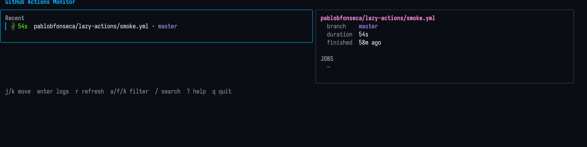

# lazy-actions

A lazygit-style terminal UI for monitoring GitHub Actions workflow runs across multiple repositories.

Watch every workflow you care about in a single pane of glass: running jobs with live step progress, recent failures with inline log tails, fullscreen log viewer with search — all driven by the keyboard.

## Screenshots

<!-- drop screenshots into docs/ with these names -->




## Features

- **At-a-glance overview** of every watched workflow run across every repo, grouped `Active` / `Recent`, sorted by recency.
- **Passive detail pane** follows the cursor: metadata, jobs, and the last ~10 lines of the active-or-failed step.
- **Fullscreen log viewer** (`enter`) with `/` search, `n/N` navigation, and colorized GitHub Actions output (`##[warning]`, `##[error]`, `##[group]`, etc.).
- **Actions**: re-run failed jobs (`F`), cancel (`x`), download artifacts (`d`), copy URL (`y`) / SHA (`Y`).
- **Filters**: status (`a`/`f`/`A`) and fuzzy text (`/` over repo/workflow/branch).
- **Adaptive polling**: 10 s while anything is running (or finished in the last 60 s), 180 s when idle. Rate-limit aware. `r` forces an immediate refresh; successful `F`/`x` auto-refresh the affected repo.
- **macOS notifications** on run state transitions (started / passed / failed / cancelled).

## Prerequisites

- Go 1.25+
- The [GitHub CLI](https://cli.github.com/) (`gh`), authenticated:
  ```
  gh auth login
  ```
  `lazy-actions` shells out to `gh api` for every request, so whatever authorization `gh` has is what the TUI uses.
- macOS for desktop notifications (the rest works everywhere Go runs).

## Install

```sh
go install github.com/pablobfonseca/lazy-actions@latest
# or from a checkout:
make build      # produces ./bin/lazyactions
make install    # copies it to ~/.local/bin/lazyactions
```

## Configuration

`lazy-actions` resolves what to watch from two places, in order:

1. **Saved config** at `~/.config/gh-action-monitor/config.yaml` (or `./config.yaml` for backward compatibility).
2. **Auto-detect** from the current directory: `git remote get-url origin` → `owner/repo`, plus every `.github/workflows/*.{yml,yaml}` file.

Saved config always wins; auto-detection is a fallback, never merged in:

- Saved config found → used as-is, and auto-detection never runs.
- No saved config, but CWD is a GitHub repo → the auto-detected entry is used as the whole config.
- Neither → startup fails with both the config error and the auto-detect error.

### Saved config format

```yaml
watches:
  - repo: "your-org/your-repo"
    workflows:
      - "ci.yml"
      - "deploy.yml"
  - repo: "your-org/other-repo"
    workflows:
      - "build.yml"
```

Workflow names are the file names under `.github/workflows/` in each repo.

## Keybindings

| Key            | Context     | Action                                  |
| -------------- | ----------- | --------------------------------------- |
| `j` / `k` / ↓↑ | normal      | Move cursor                             |
| `g` / `G`      | normal      | First / last run                        |
| `enter`        | normal      | Open fullscreen log viewer              |
| `o`            | normal      | Open run URL in browser                 |
| `r`            | normal      | Refresh all repos now                   |
| `F`            | normal      | Re-run failed jobs (confirm)            |
| `x`            | normal      | Cancel run (confirm)                    |
| `d`            | normal      | Download artifacts (prompts for path)   |
| `y` / `Y`      | normal      | Copy run URL / commit SHA               |
| `n`            | normal      | Toggle mobile notifications for workflow |
| `a` / `f` / `A`| normal      | Filter: active / failed / all           |
| `/`            | normal      | Fuzzy filter prompt                     |
| `esc`          | normal      | Clear filter                            |
| `?`            | normal      | Toggle help modal                       |
| `q` / `ctrl-c` | any         | Quit                                    |
| `/`            | log viewer  | Search                                  |
| `n` / `N`      | log viewer  | Next / previous match                   |
| `g` / `G`      | log viewer  | Top / bottom                            |
| `esc`          | modal       | Close modal                             |

## Notifications

**Desktop** — every run state transition (started / passed / failed / cancelled) fires a native
notification via [NotifiCLI](https://github.com/pablobfonseca/notificli) when it is on `PATH`,
falling back to `osascript`. Notifications carry **View Run** and, on failure, **View Failed Job**
actions that open the relevant GitHub page.

**Mobile** — completed runs additionally fan out to any configured away-from-screen channel:

| Channel                         | Environment variables                      |
| ------------------------------- | ------------------------------------------ |
| [brrr.now](https://brrr.now)    | `BRRR_TOKEN`                               |
| Telegram                        | `TELEGRAM_BOT_TOKEN` + `TELEGRAM_CHAT_ID`  |

Variables are read from `./.env` or `~/.config/gh-action-monitor/.env` at startup (existing
environment variables are never overridden).

Mobile delivery is **opt-in per workflow**: press `n` on a selected run to toggle it. Opted-in
workflows show a 🔔 next to the workflow name, and the selection is persisted to
`~/.config/gh-action-monitor/mobile-notify.json` so it survives restarts.

## Development

```sh
make check      # fmt + vet + test
make run        # run against local config
make help       # list available targets
```

## Project Layout

```
main.go        entry point + resolveConfig fallback
dotenv.go      .env loader
internal/
├── config/     YAML config loading + repo auto-detect
├── gh/         GitHub API client + caches (reads in api.go, writes in actions.go, logs in logs.go)
├── clip/       pbcopy wrapper
├── notify/     desktop (NotifiCLI/osascript) + mobile (brrr.now, Telegram) notifications
└── tui/        Bubble Tea components
    ├── model.go                    root model + mode routing
    ├── overview.go / overview_test runs list + cursor
    ├── detail.go                   metadata + jobs + log tail
    ├── logviewer.go                fullscreen logs + search
    ├── help.go / confirm.go        modals
    ├── prompt.go                   inline one-line prompt
    ├── filter.go / filter_test     status + fuzzy matching
    ├── colorize.go                 log line coloring
    ├── keys.go                     centralized keymap
    ├── loggroups.go                ##[group] folding
    └── styles.go                   lipgloss styles
```

Built on [Bubble Tea](https://github.com/charmbracelet/bubbletea), [Lipgloss](https://github.com/charmbracelet/lipgloss), and [Bubbles](https://github.com/charmbracelet/bubbles).

## Roadmap

- **Phase 3** — Local dry-runs via [`act`](https://github.com/nektos/act).
